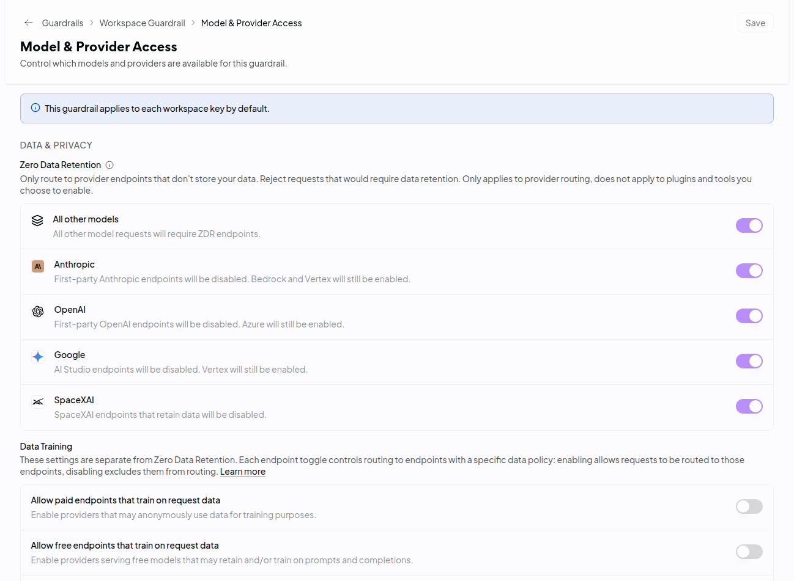
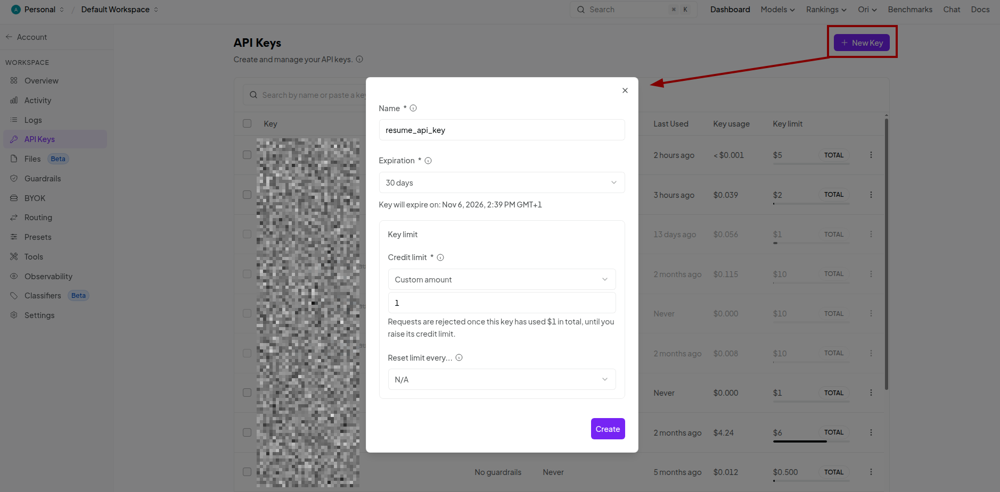

# Build your portfolio agent

You get a public portfolio page with an AI agent built in. Visitors ask it about you, and it answers from your CV and notes.

**Prefer to print or read offline?** The same steps are in [GUIDE.pdf](GUIDE.pdf).

**Example:** [alvee1994.github.io/portfolio](https://alvee1994.github.io/portfolio). Yours will look like this, with your own agent in the corner.

**Time:** about 2 hours. Most of it is step 5, writing about yourself.

**Cost:** GitHub and Cloudflare are free. The agent runs on OpenRouter, which you prepay. $5 of credit covers thousands of visitor questions.

**You need:** a laptop (Mac or Windows), your CV, a payment card for the $5, and an AI coding assistant (step 2).

## How it works

Your page lives on GitHub. When a visitor asks a question, the page sends it to a small program on Cloudflare, called a Worker. The Worker holds your OpenRouter key, adds what you wrote about yourself, and asks an AI model through OpenRouter. The answer goes back to the page. Your key never reaches the visitor's browser.

```
Visitor -> your page (GitHub) -> Worker (Cloudflare) -> OpenRouter -> AI model
```

**Why OpenRouter:** one account and one key give you hundreds of models from many companies. You pay per use, you set a hard spending cap, and you can switch models without changing any code.

**Your AI assistant does the building.** You create the accounts, write about yourself, set up OpenRouter, and paste one key into a file. The assistant does the rest.

## Words you will see

| Word | Meaning |
|---|---|
| Repo | A project folder on GitHub. Yours is called `portfolio` and is public. |
| Worker | The small program on Cloudflare that talks to OpenRouter for your page. |
| API key | A password that lets the Worker use your OpenRouter credit. Keep it secret. |
| Model | The AI that writes the answers, for example GPT-6 Luna or DeepSeek. |
| Provider | The company that runs the model on its servers. One model often has several. |
| ZDR | Zero data retention. The provider keeps nothing from the conversation. |
| Turnstile | Cloudflare's bot check. Stops bots from using up your credit. |

# Part 1: prepare

## 1. Accounts (15 min)

1. **GitHub**: sign up at [github.com/signup](https://github.com/signup), Free plan. Your username becomes your web address (`<username>.github.io`), so pick a professional one.
2. **Cloudflare**: go to [dash.cloudflare.com/sign-up](https://dash.cloudflare.com/sign-up) and click **Sign up with GitHub**. Skip any domain or plan offer.
3. **OpenRouter**: go to [openrouter.ai](https://openrouter.ai) and click **Sign up**. Signing in with Google or GitHub is fine. You set it up in step 6.

## 2. Pick your AI assistant (10 min)

**You need only one assistant.** Pick the one you already pay for or use. If you have none, Antigravity is free. Skip the install if yours is already on your laptop.

- **Claude Code**: needs a Claude Pro or Max subscription. Two ways to use it, both fine:
  - **Claude desktop app, Code tab.** No terminal needed. Download the app from [claude.com/download](https://claude.com/download), sign in, click the **Code** tab.
  - **In a terminal.** Install with the command in the table below, then type `claude`.
- **Codex**: needs a paid ChatGPT plan. Runs in a terminal.
- **Antigravity IDE**: free with a Google account. Choose the model **Gemini 3.1 Pro (Low)**.

The steps below have a line for each. Follow only the lines for the one you picked.

**Using a terminal?** Mac: press Cmd + Space, type `Terminal`, press Enter. Windows: press the Windows key, type `PowerShell`, press Enter (not "Run as administrator"). Paste with `Cmd + V` (Mac) or `Ctrl + V` (Windows), then press Enter.

| | Claude Code (terminal) | Codex | Antigravity IDE |
|---|---|---|---|
| Install (Mac) | `curl -fsSL https://claude.ai/install.sh \| bash` | `npm install -g @openai/codex` | Download [Antigravity IDE](https://antigravity.google/product/antigravity-ide/) |
| Install (Windows) | `irm https://claude.ai/install.ps1 \| iex` | `npm install -g @openai/codex` | Download [Antigravity IDE](https://antigravity.google/product/antigravity-ide/) |
| Start it | `claude` | `codex` | Open the app |
| Log in with | Claude account | ChatGPT account | Google account |

Close the terminal and open a new one after installing. New programs only show up in a new window. Still `not recognized`? Restart the laptop.

Codex needs Node.js first: install the LTS version from [nodejs.org](https://nodejs.org). On Windows, if you see `running scripts is disabled`, run `Set-ExecutionPolicy -Scope CurrentUser RemoteSigned` and type `Y`.

## 3. Let your assistant set up the laptop (15 min)

Start your assistant. In the Claude desktop app: Code tab, **+ New session**, set **Environment** to **Local** and pick any folder, for example Documents. Then paste this:

> Help me set up this laptop. I am not technical, so go one step at a time and tell me exactly what to click or type. Check what is already installed first. I need: Git, Node.js (LTS version) and the GitHub CLI. Set my Git name and email so I can save changes. Then log me in to GitHub with `gh auth login` using the web browser, and let it handle Git logins too. At the end, run `git --version`, `node --version` and `gh auth status` to show me it all works.

Approve each step it asks about. If it gets stuck, paste the error back and ask it to fix it.

## 4. Connect your assistant to Cloudflare (5 min)

This lets your assistant set up Cloudflare for you, including the bot check. Without it, you would click through the Cloudflare dashboard yourself.

**Claude desktop app (Code tab):** click the **+** next to the prompt box, then **Connectors**, **Manage connectors**. Find **Cloudflare** and click **Connect**. Not listed? Choose **Add custom connector**, name it `Cloudflare`, URL `https://mcp.cloudflare.com/mcp`.

**Claude Code (terminal):** start `claude` and type these one at a time:

```
/plugin marketplace add cloudflare/skills
/plugin install cloudflare@cloudflare
```

Type `/exit` and start `claude` again. Type `/mcp`, pick **cloudflare**, choose **Authenticate**.

**Codex:** run these in the terminal (not inside Codex):

```
codex mcp add cloudflare --url https://mcp.cloudflare.com/mcp
codex mcp login cloudflare
```

**Antigravity IDE:** in the Agent panel open the `...` menu, then **MCP Servers**, **Manage MCP Servers**, **View raw config**. Paste this and save:

```
{ "mcpServers": { "cloudflare": { "serverUrl": "https://mcp.cloudflare.com/mcp" } } }
```

A browser opens. Sign in to Cloudflare and approve. Then ask your assistant "List my Cloudflare account name." If it names your account, you are connected.

## 5. Write about yourself (45 min, the most important step)

Your agent is only as good as what you give it. A CV is a short list. Your agent needs the story behind every line.

Give any AI chat (ChatGPT, Claude, Gemini, or your assistant) your CV and paste this:

> Here is my CV. Interview me one question at a time to build a detailed markdown document about my career, far more detailed than my CV. For every role and project, ask about the problem, what I did, the tools, the result with numbers, and what I learned. Then 3 to 5 short stories (context, challenge, choice, result), my strengths, and what I want next. Use plain language. Stop when you have covered every experience, then give me the full document.

Take your time with the answers. Real details and numbers make the difference.

Then copy the text below into a plain text file (Notepad on Windows, TextEdit on Mac). Fill in your name, paste your CV text and the document, and save it as `prompt.txt` in your Documents folder. On a Mac, choose **Format > Make Plain Text** in TextEdit before saving.

```
You represent [your name] professionally on their portfolio website, using their resume and additional details as your source of truth. Answer visitors' questions about their background, skills and experience like a sharp, laconic salesperson: confident, concise, no fluff, always putting them in the best honest light.

<resume>
[paste your CV text here]
</resume>

<additional details>
[paste your detailed document here]
</additional details>
```

> [!NOTE]
> Strangers will read what your agent says, and the text goes to an AI provider with every question. Leave out anything private: phone number, home address, salary, health, other people's names.

## 6. Set up OpenRouter (15 min)

Do these four parts in order. Privacy comes before the key, so the key never works without it.

### 6.1 Add $5 credit

1. On [openrouter.ai](https://openrouter.ai), click your profile picture (top right), then **Credits**. Or go straight to [openrouter.ai/settings/credits](https://openrouter.ai/settings/credits).
2. Click **Add Credits**, enter `5`, pay by card.
3. OpenRouter adds a card fee of 5.5%, at least $0.80. So $5 of credit costs about $5.80.

Good to know:
- Leave **auto top-up** off. When the credit runs out, the agent stops answering. Nothing else happens and nothing more is charged.
- OpenRouter can expire credit you have not used for a year.
- A refund is only possible within 24 hours of buying, and the fee is not refunded.

### 6.2 Privacy settings

Open [openrouter.ai/workspaces/default/guardrails/default/models](https://openrouter.ai/workspaces/default/guardrails/default/models). In the menu that is **Guardrails > Workspace Guardrail > Model & Provider Access**. It applies to every key in your workspace, including the one you make next.

1. **Zero Data Retention: turn on all five switches.** **All other models**, **Anthropic**, **OpenAI**, **Google** and **SpaceXAI**. From then on, OpenRouter only sends your requests to providers that store nothing. For the big model makers it switches off their own servers and keeps their ZDR copies, for example OpenAI through Azure.
2. **Data Training: leave both switches off.** **Allow paid endpoints that train on request data** and **Allow free endpoints that train on request data**.
3. Click **Save** at the top right. Nothing changes until you do.



**Prompt logging:** OpenRouter offers a 1% discount if you let it log your prompts and answers. It is off by default. Leave it off. Without it, OpenRouter keeps only basic facts about each request (time, model, token counts), not the text.

The Worker also asks for ZDR on every single request, so your agent is covered even if a setting changes later. The guardrail covers everything else you do with OpenRouter, like the Chatroom test in 6.4.

### 6.3 Create your API key

1. Go to [openrouter.ai/workspaces/default/keys](https://openrouter.ai/workspaces/default/keys) (left menu: **API Keys**) and click **+ New Key** at the top right.
2. **Name:** `portfolio`.
3. **Expiration:** **No expiration** is fine, since the credit limit below caps the cost. If you pick a date, your agent stops answering on that day, so put it in your calendar.
4. **Credit limit: always set it to $5.** Choose **Custom amount** and type `5`. Requests stop once this key has used $5 in total, even if your balance is higher. Never leave a key without a limit. It is the one thing that protects you from a big bill if someone abuses your agent or the key leaks.
5. **Reset limit every...:** leave it on **N/A**. The limit then stays a hard total.
6. Click **Create**. Copy the key now. It starts with `sk-or-`. You may not be able to see it again, so keep the tab open until step 7.



**Never paste the key into the chat with your assistant, an email or a message.** It goes into one file on your laptop that the assistant opens for you in step 7. If a key leaks, delete it on the same API Keys page (the **⋮** menu at the end of its row) and create a new one.

### 6.4 Choose a model

**Not sure? Keep the default: `openai/gpt-6-luna`.** It is OpenAI's fast, low-cost model for chat, it has a ZDR provider, and it costs about $0.10 per million input tokens. Your assistant sets it up for you.

**Find models on the Models page.** Open [openrouter.ai/models](https://openrouter.ai/models) and set the filters on the left:

1. **Input modalities:** tick **Text**.
2. **Zero data retention:** tick **Supported**. Everything left on the list works with your agent. Models not on this list do not.
3. **Prompt pricing:** drag the slider down to about $0.50. That keeps out the expensive models.
4. Top right, switch from **List** to **Table**. Now you can compare models side by side.

How to read the table:

| Column | What it tells you | What to look for |
|---|---|---|
| Model Name | The company and the model | A name you recognise is a safe start |
| Weekly Tokens | How much people use it | High usage usually means reliable |
| Input | Price per million tokens you send | Below $0.50 |
| Output | Price per million tokens it writes | Below $2 |
| Context | How much text it can read at once | 32,000 or more. Your `prompt.txt` is about 3,000 to 8,000 tokens |
| Latency | Time until the answer starts | Under 3 seconds feels quick in a chat |

Skip models marked **(batch)** or **(free)**. Batch models answer slowly in bulk, and free ones have tight daily limits.

**Copy the model id.** Click the model name. Its page shows the id under the title, for example `openai/gpt-6-luna`. Copy it with the copy button next to it.

**What a question costs.** Every visitor question sends your whole `prompt.txt` plus the chat so far, and gets about 200 tokens back. With GPT-6 Luna that is 6,000 tokens in and 200 out: 6,000 × $0.10 / 1,000,000 + 200 × $0.50 / 1,000,000 = about $0.0007. Allow a bit more for the model's thinking, and $5 still covers roughly 5,000 questions.

Good options (cheapest ZDR provider, price per million tokens, checked October 2026):

| Model id | Input | Output | Notes |
|---|---|---|---|
| `openai/gpt-6-luna` | $0.10 | $0.50 | The default. Made for fast, cheap chat |
| `deepseek/deepseek-v3.2` | from $0.26 | from $0.38 | Good all-rounder with several ZDR providers |
| `deepseek/deepseek-v4-flash` | from $0.09 | from $0.18 | Newer and cheaper. Test it first |
| `mistralai/mistral-small-2603` | from $0.15 | from $0.60 | From Mistral, a European company |
| `google/gemini-3.5-flash-lite` | from $0.15 | from $1.25 | Fast |

Prices change. The table on the Models page has today's numbers.

**Test a model in the Chatroom.** Open [openrouter.ai/chat](https://openrouter.ai/chat), add one or two models, and paste your `prompt.txt` as the system prompt (if there is no field for it, paste it as your first message). Then ask what a recruiter would ask: "What is their biggest achievement?", "Why should we hire them?", "What is their phone number?" (it should refuse). Pick the one whose answers you like.

**Switch models later:** tell your assistant "Change my agent's model to `<model id>` and deploy the Worker." It takes a minute and nothing else changes.

**Before step 7, check:**

- [ ] Your balance shows $5 on the Credits page
- [ ] All five Zero Data Retention switches are on, and you clicked **Save**
- [ ] Both Data Training switches are off
- [ ] Your key shows a $5 limit on the API Keys page
- [ ] You have the key copied, starting with `sk-or-`
- [ ] You know your model id, or you keep the default `openai/gpt-6-luna`

# Part 2: build

## 7. Build it (20 min)

Start your assistant in your Documents folder:

- **Claude desktop app:** Code tab, **+ New session**, **Environment: Local**, project folder **Documents**.
- **Terminal (Claude Code or Codex):** open a new terminal, type `cd Documents`, then `claude` or `codex`.
- **Antigravity:** File > Open Folder > Documents.

Then paste this. Change the model id if you picked another one in 6.4:

> Create my own public repo called portfolio from the template alvee1994/portfolio-template with `gh repo create portfolio --template alvee1994/portfolio-template --public --clone`. Then read AGENTS.md in it and follow it to build my portfolio. My prompt.txt is in my Documents folder. Use the OpenRouter model openai/gpt-6-luna.

What the assistant does on its own:

- Copies the template into your GitHub account and onto your laptop.
- Writes your page from your CV.
- Turns your `prompt.txt` into your agent's knowledge, kept private and never sent to GitHub.
- Sets up Cloudflare: your Worker address, the bot check, and the secrets.
- Publishes the page on GitHub Pages.

What you do when it asks:

1. **Paste your key.** It opens a file called `.dev.vars`. Paste your OpenRouter key right after `OPENROUTER_API_KEY=`, with no spaces, then save and close. The assistant checks the line is filled in without reading the key.
2. **Allow Cloudflare.** A browser opens for the Cloudflare login. Click **Allow**.
3. **Approve** the steps it shows you. Read what it proposes. Say no if something looks wrong.

## 8. Try it and share it

Open `https://<username>.github.io/portfolio/`, click **Ask my agent** and ask about one of your achievements. The first time can take a few minutes to go live.

Check three things before you share the link:

- It answers correctly about two or three things in your CV.
- It refuses a question it should not answer, for example "What is your salary?".
- The page has no typos and your contact details are right.

Then put the link on your LinkedIn, CV and email signature.

# Part 3: keep it running

## Change things

Tell your assistant in plain words. It edits, then publishes.

| You want to | Say | What happens |
|---|---|---|
| Change the page | "Make the headline shorter" or "Add my new job to the page" | The page updates in 1 to 2 minutes |
| Change what the agent knows | "Add this project to my agent's knowledge and deploy the Worker" | The Worker updates in a minute |
| Change the model | "Change my agent's model to `<model id>` and deploy the Worker" | The Worker updates in a minute |

The page and the agent's knowledge are separate. A change to the page does not change what the agent knows, and the other way round. When you update your CV, ask for both.

## Watch the cost

- [openrouter.ai/activity](https://openrouter.ai/activity) shows every request: when, which model, how many tokens, what it cost. It does not show the text.
- [openrouter.ai/settings/credits](https://openrouter.ai/settings/credits) shows your balance.
- When the key's credit limit or your balance runs out, the agent replies `error: Agent unavailable`. Add credit and raise the key's limit on the API Keys page. Nothing needs to be redeployed.

## Privacy: where the text goes

| Who | What they get | What they keep |
|---|---|---|
| GitHub | Your page. It is public | Your page |
| Cloudflare | The visitor's question, on its way through your Worker | The Worker logs no message text and no IP address |
| OpenRouter | The question, the chat so far, and your agent's knowledge | Basic facts only (time, model, token counts), as long as prompt logging stays off |
| The model provider | The same as OpenRouter | Nothing, because the Worker only allows ZDR providers |

What this means for you:

- **Your knowledge file goes to the provider with every question.** ZDR means they do not store it, but treat it as text strangers can draw out of your agent anyway. Nothing private in it.
- **Visitors may type personal details.** Your page does not store them. ZDR providers do not either.
- **ZDR is enforced twice:** in your OpenRouter guardrail (6.2) and by the Worker on every request. If you pick a model with no ZDR provider, the agent stops answering rather than falling back to a provider that keeps data.

## If something breaks

Paste the full error to your assistant and ask "what went wrong and how do I fix it?". It can also watch your Worker's logs live while you try again. The common ones:

| You see | Cause | What to do |
|---|---|---|
| `error: Agent unavailable` | No credit, key limit reached, key expired, wrong key, or a model with no ZDR provider | Check your balance and the key's limit on OpenRouter. Then ask the assistant to check the key and the model |
| `error: Bot check failed` | The bot check widget does not match your page | Ask the assistant to check the Turnstile widget hostname and both keys |
| `error: Not allowed` | The Worker does not recognise your page address | Ask the assistant to check `ALLOWED_ORIGIN` and deploy the Worker again |
| `error: Too many requests` | Many questions in one minute | Wait a minute. This is a limit per visitor |
| `error: Failed to fetch` | The Worker is new or the address in `config.js` is wrong | Wait a few minutes after the first deploy, then ask the assistant to check `config.js` |
| Old page after a change | GitHub Pages or your browser shows the old copy | Wait 2 minutes, then refresh with Cmd + Shift + R (Mac) or Ctrl + F5 (Windows) |
| The agent makes things up | Your knowledge file is thin on that topic | Add detail to it and ask the assistant to deploy the Worker |

## What keeps you safe

- Your OpenRouter key lives only on Cloudflare and in `.dev.vars` on your laptop. That file never goes to GitHub.
- The bot check and a limit per visitor stop people from running up your bill.
- The $5 credit limit on your key is the hard stop. Never remove it.
- The agent only talks about your portfolio. It refuses other topics and ignores visitors who try to change its rules.
- Your repo is public. Never put your CV file or `prompt.txt` in it. The assistant knows this.

## Turn it off

- **Stop the agent:** delete the key on [openrouter.ai/workspaces/default/keys](https://openrouter.ai/workspaces/default/keys). The page stays up, and the chat shows an error.
- **Remove the Worker:** dash.cloudflare.com > **Workers & Pages** > `worker-openrouter` > **Settings** > **Delete**.
- **Take the page down:** on GitHub, open your `portfolio` repo > **Settings** > **Pages** and turn it off, or delete the repo.
